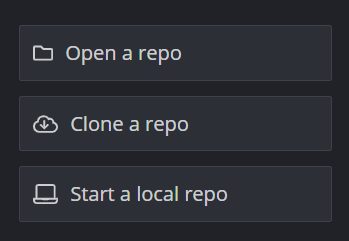
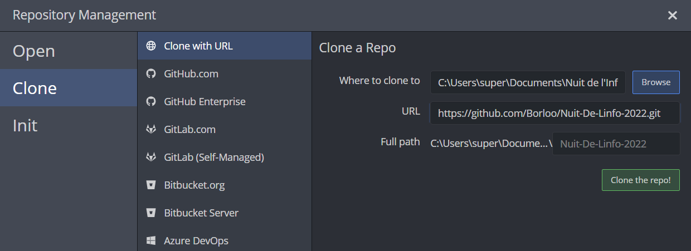
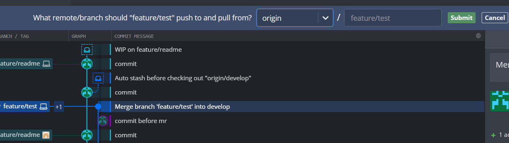
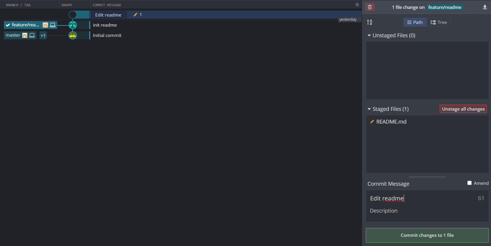
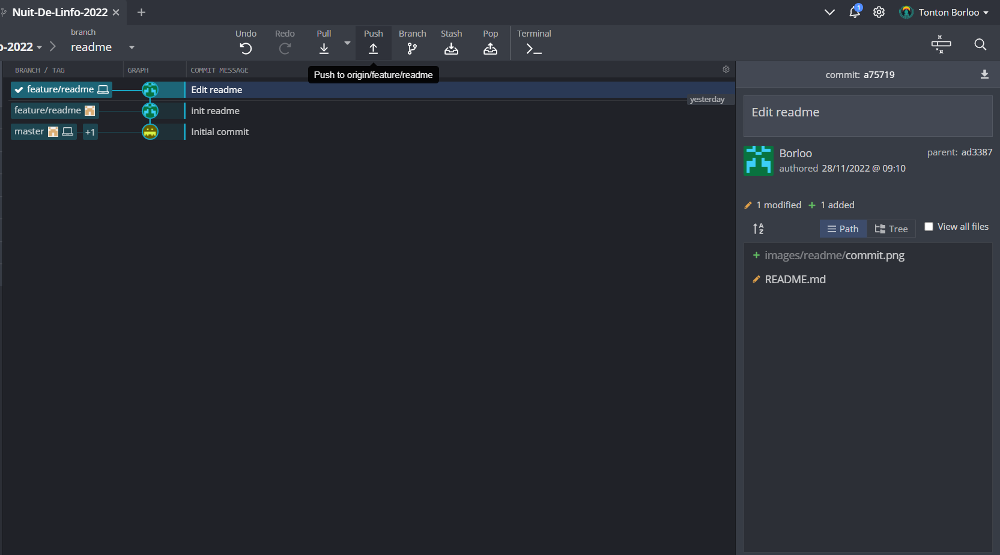
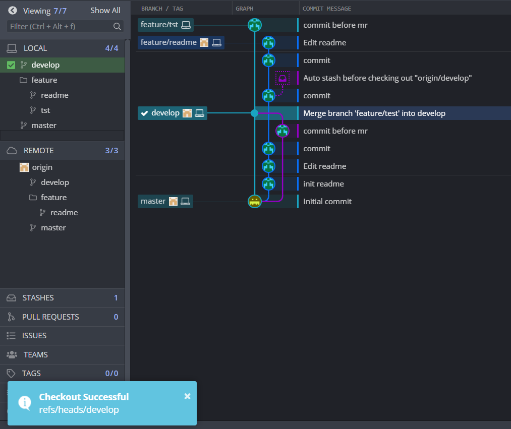
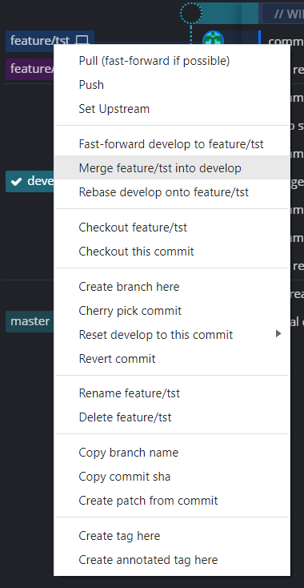
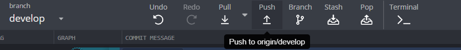

# Scrumitos

## Tya mis le kimono 

1. [Récupération du projet](#1)
2. [Branche feature](#2)
3. [Commit & Push](#3)
4. [Merge feature -> develop](#4)
5. [Merge develop -> master](#5)

###  Récupération du projet en local

Ligne de commande :

```bash 

git clone https://github.com/Borloo/Scrumitos.git

```

GitKraken :





<a name="2"></a>

### Créer une nouvelle branche feature

Règles :

TOUJOURS mettre à jour localement la branche develop avant de créer la branche

Ligne de commande :

```bash

git checkout develop
git pull
git checkout -b feature/name_feature

```

GitKraken :



<a name="3"></a>

### Commit and push

Règles :

Pour une feature :

- Seul : Commit and push autant que tu veux
- Plusieurs : Préférer le push lorsque le résultat est satisfaisant et intéressant que les autres l'ai, commit à foison

Ligne de commande :

```bash

git add .
git commit -m "message"
git push feature/feature-name

```

GitKraken :





<a name="4"></a>

### Merge feature -> develop

Règles :

Avant de faire le merge entre sa feature et develop, inspecter le code et supprimer tout test local (print, dump)

Ligne de comlande :

```bash

git checkout -b branche-name
git add .
git commit -m "message"
git checkout develop
git merge 
git push

```

GitKraken :







<a name="5"></a>

### Merge develop -> master

ATTENTION : Si jamais vous avez un doute, demandez moi

Règles :
- Avoir bien re-re-regardé son code pour ne pas laisser des fonctions de test ou du code commenté
- Avoir bien testé sur develop que tout marchait avec tout
- Prendre contact avec le responsable de votre partie, avec qui on validera la merge request ensemble